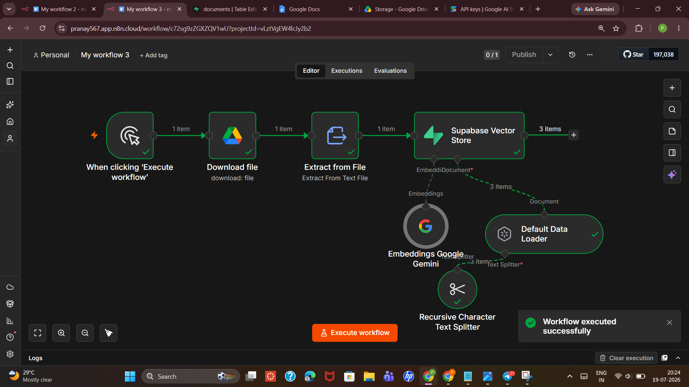
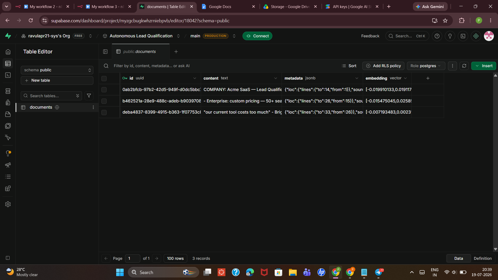
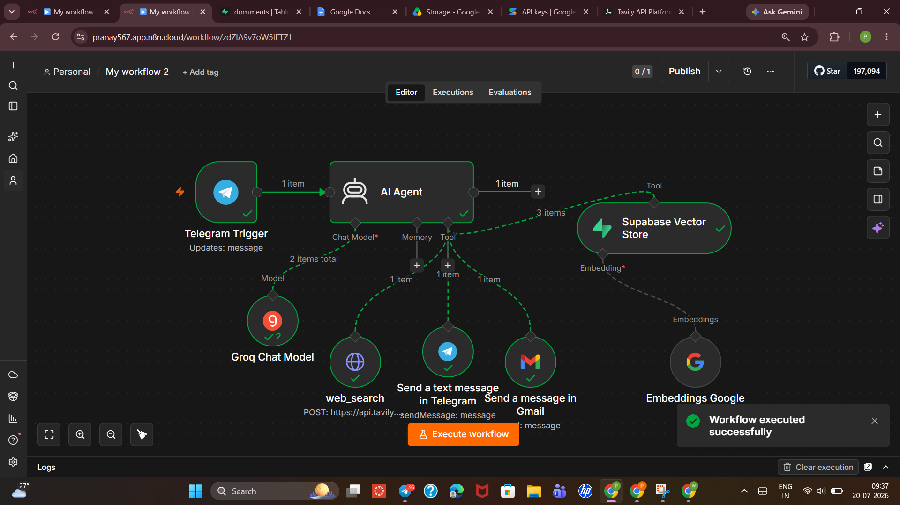

# Autonomous Lead Qualification and Outreach Agent

An AI agent that automatically qualifies inbound sales leads, researches them in real time, scores them against a company's Ideal Customer Profile (ICP), and conditionally sends personalized outreach emails — all without human involvement.

Built entirely with no-code/low-code tools, combining **Retrieval-Augmented Generation (RAG)** and **agentic tool-calling** to make grounded, explainable decisions instead of relying on generic LLM guesses.

---

## The Problem

When leads message a company, someone has to manually:
1. Read the message
2. Research the company (size, industry, legitimacy)
3. Check it against internal ICP/pricing criteria
4. Decide whether it's worth a sales email
5. Write and send that email

This is slow (5–15 minutes per lead), inconsistent (different people score leads differently), and doesn't scale. Leads get missed or answered too late.

## The Solution

This system automates the entire pipeline. The moment a lead messages a Telegram bot, an AI agent:

1. Retrieves the company's own ICP, pricing, and past-deal data from a vector database
2. Searches the web to verify the lead's company and gather additional signals
3. Scores the lead 1–10 using explicit, auditable criteria
4. **Conditionally** sends a personalized email only if the score is ≥ 7
5. Always replies to the lead on Telegram, regardless of score

End-to-end response time: **8–20 seconds**, running 24/7, unattended.

---

## Architecture

Two separate workflows, built in [n8n](https://n8n.io):

### Workflow 1 — Data Ingestion (`data-ingestion`)

Loads the company's reference document (ICP criteria, pricing tiers, past won/lost deal examples) into a searchable vector database.

```
Manual Trigger
   → Download File (Google Drive)
   → Extract from File
   → Supabase Vector Store (Insert)
        ├─ Recursive Character Text Splitter (chunk ~500 chars, 50 overlap)
        └─ Embeddings: Google Gemini (models/gemini-embedding-001, 3072 dims)
```

Run once at setup, and again whenever the ICP/pricing document is updated.

### Workflow 2 — The Agent (`chatbot`)

Listens on Telegram 24/7. On each incoming message, an AI Agent (Groq LLM) reasons through a fixed decision process and calls tools as needed.

```
Telegram Trigger (on message)
   → AI Agent (Groq Chat Model)
        Tools:
        ├─ knowledge_base_search   → Supabase Vector Store (Retrieve, same embedding model as Workflow 1)
        ├─ web_search              → HTTP Request → Tavily Search API
        ├─ send_email              → Gmail (conditional: only if score ≥ 7)
        └─ notify_lead_via_telegram → Telegram (always runs)
```

**Decision logic (from the agent's system prompt):**

| Score | Meaning | Action |
|-------|---------|--------|
| 8–10  | Strong ICP fit + urgency signal | Send email + Telegram reply |
| 5–7   | Loose fit / unclear signals | No email, Telegram reply only (7 is the send threshold) |
| 1–4   | Outside ICP / red flags (solo founder, hobby project, explicit disinterest) | No email, Telegram reply only |

---

## Why RAG + Agentic Tool-Calling

- **Without RAG**, the LLM would use generic training knowledge instead of *this company's* actual ICP, pricing, and deal history — leading to ungrounded, inconsistent scoring.
- **Without tool-calling**, the system could only generate text, not take real action (verifying a company externally, sending an email, replying on the correct channel).
- **Conditional tool execution** (`send_email` only firing above the threshold) is what makes this genuinely agentic rather than a fixed if/else script — the LLM reasons over retrieved evidence to decide *whether* to act, not just *what* to say.

---

## Tech Stack

| Component | Tool |
|---|---|
| Orchestration | [n8n](https://n8n.io) (Cloud) |
| Vector database | [Supabase](https://supabase.com) (pgvector) |
| LLM (agent reasoning) | Groq |
| Embeddings | Google Gemini (`models/gemini-embedding-001`, 3072-dim) |
| Lead intake channel | Telegram Bot API |
| External research | [Tavily](https://tavily.com) Search API |
| Outreach | Gmail API (OAuth2) |

Entirely free-tier — no paid infrastructure required to run this.

---

## Database Schema (Supabase / pgvector)

```sql
create extension if not exists vector;

create table documents (
  id uuid primary key default gen_random_uuid(),
  content text,
  metadata jsonb,
  embedding vector(3072)
);

create function match_documents (
  query_embedding vector(3072),
  match_count int default null,
  filter jsonb default '{}'
) returns table (id uuid, content text, metadata jsonb, similarity float)
language plpgsql as $$
#variable_conflict use_column
begin
  return query
  select id, content, metadata,
    1 - (documents.embedding <=> query_embedding) as similarity
  from documents
  where metadata @> filter
  order by documents.embedding <=> query_embedding
  limit match_count;
end;
$$;
```

Full schema and setup notes: [`docs/database-schema.sql`](docs/database-schema.sql)

---

## Agent System Prompt

The full prompt that governs the agent's reasoning and tool-use sequence is in [`docs/system-prompt.md`](docs/system-prompt.md).

---

## Demo / Test Results

Two representative test cases, showing the conditional logic working correctly:

**High-score lead** — "Head of Ops at a 120-employee B2B SaaS company, asked about Enterprise pricing"
→ Scored ≥ 7 → personalized email sent automatically + Telegram acknowledgment sent

**Low-score lead** — "Just curious what this does, not looking to buy anything right now"
→ Scored < 7 → no email sent (correctly withheld) → Telegram acknowledgment still sent

Screenshots of both flows are in [`screenshots/`](screenshots/).

**Workflow 1 in action:**



Document successfully chunked, embedded, and stored in Supabase:



**Workflow 2 in action:**



<!-- Optional: add once posted
🎥 [Watch the 60-second demo](your-instagram-reel-link-here)
-->

---

## What I'd Improve Next (v2)

- **Conversation memory** — currently each message is scored independently; a returning lead isn't recognized
- **Human-in-the-loop override** — a review step before high-stakes actions (e.g. sending email) at higher lead volume
- **Structured logging/dashboard** — currently decisions are only visible in n8n execution logs, not a persistent audit trail
- **Rate-limit and cost handling** — free-tier APIs won't scale past a few hundred leads/day without upgrading

---

## Repo Structure

```
lead-qualification-agent/
├── README.md
├── workflows/
│   ├── workflow-1-data-ingestion.json
│   └── workflow-2-lead-agent.json
├── screenshots/
│   ├── workflow-1-overview.png
│   ├── workflow-2-overview.png
│   ├── telegram-high-score-example.png
│   ├── telegram-low-score-example.png
│   └── email-sent-example.png
└── docs/
    ├── system-prompt.md
    └── database-schema.sql
```

---

## Author

**Ravula Pranay** — [GitHub](https://github.com/RavulaPranay) · [LinkedIn](http://www.linkedin.com/in/pranay-ravula-03131a270)
